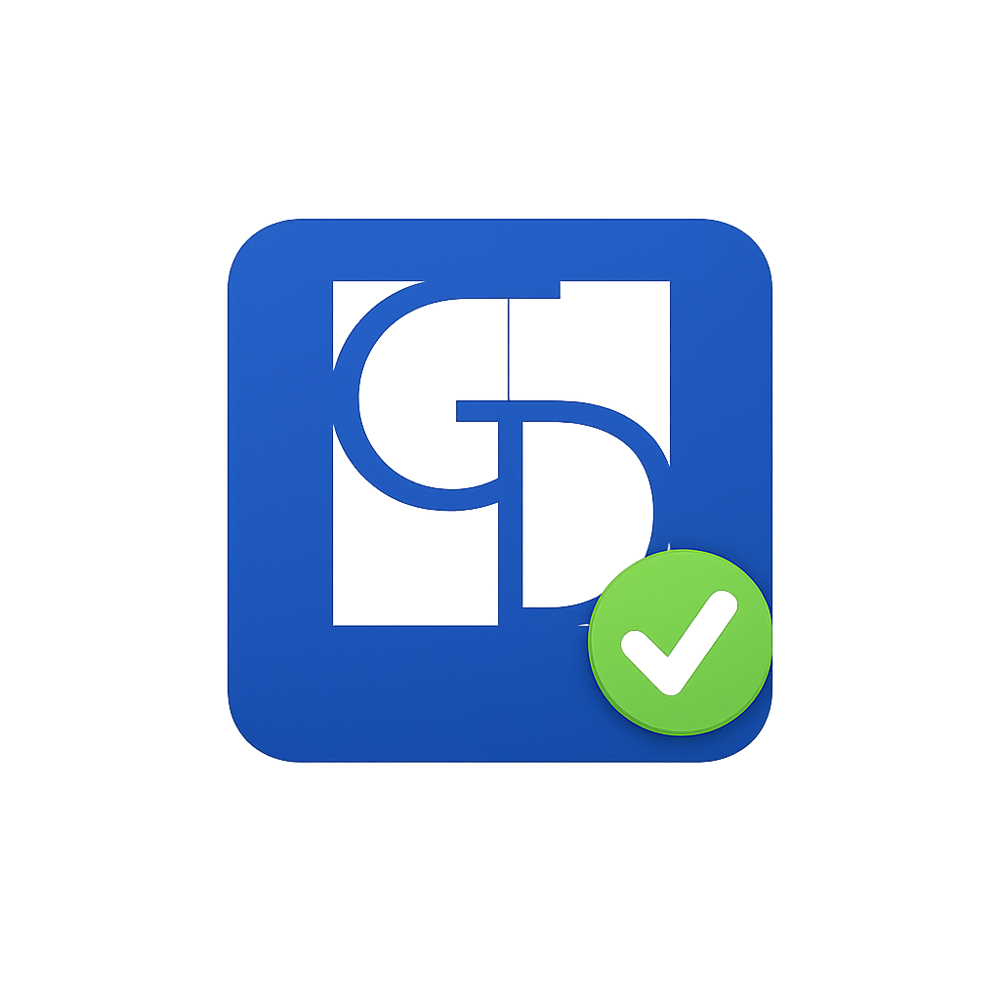

<p align="center">
  
</p>

<h1 align="center">GDLEX PCT File Validator</h1>

<p align="center">
  <em>Pre-deposit validator for Italian PCT/PDUA telematic filings (GUI + CLI)</em>
</p>

<p align="center">
  Developed by <strong>STUDIO GD LEX – Marco Gianese</strong>
</p>

---


Tool desktop (GUI + CLI) per analisi e correzione conservativa dei file
destinati al deposito telematico PCT / PDUA.

> Progetto indipendente sviluppato da Marco Gianese -- STUDIO GD LEX\
> Non affiliato al Ministero della Giustizia o ad altri enti pubblici.

------------------------------------------------------------------------

## Download

Dalla pagina **Releases** del repository:

-   **Windows**: `gdlex-pct-validator-<version>-windows.exe`
-   **Debian/Ubuntu**: `gdlex-pct-validator_<version>_amd64.deb`
-   **Checksum**: file `.sha256` allegati

------------------------------------------------------------------------

## Installazione

### Windows

1.  Scaricare l'eseguibile `.exe`
2.  Avviare il setup per-user
3.  Eseguire dal menu Start

> Windows SmartScreen può mostrare un avviso sugli eseguibili non
> firmati.

------------------------------------------------------------------------

### Debian / Ubuntu

Installazione manuale:

``` bash
sudo dpkg -i gdlex-pct-validator_<version>_amd64.deb
sudo apt -f install
```

Oppure tramite repository APT GDLEX (se configurato):

``` bash
sudo apt update
sudo apt install gdlex-pct-validator
```

------------------------------------------------------------------------

## Utilizzo

Avvio GUI:

``` bash
gdlex-gui
```

Verifica versione:

``` bash
gdlex-check --version
```

------------------------------------------------------------------------

## Architettura Release

Sistema di build automatizzato tramite GitHub Actions:

-   Versione derivata esclusivamente dal tag Git
-   Generazione automatica icone
-   Build deterministica dei pacchetti
-   Pubblicazione asset in Release
-   Aggiornamento repository APT via workflow dedicato

Nessun artefatto binario è versionato nel repository.

------------------------------------------------------------------------

## Sviluppo locale

``` bash
python3 -m venv .venv
source .venv/bin/activate
pip install -e .
pytest -q
```

------------------------------------------------------------------------

## Qualità codice

``` bash
ruff check core cli gui tests tools
python -m pytest -q
```

La quality gate gira nel workflow CI su Pull Request.

------------------------------------------------------------------------

## Licenza

© 2026 Marco Gianese -- STUDIO GD LEX

Il codice del progetto è distribuito sotto **GPL-3.0-or-later**.
Il testo completo della licenza è disponibile nel file `LICENSE`.

Il software è fornito "as is", senza garanzie espresse o implicite.
L'utente resta responsabile della verifica dei risultati prodotti e del
controllo finale prima del deposito telematico. Il software non
sostituisce il controllo professionale dell'utente.

Le dipendenze di terze parti mantengono le rispettive licenze; per un
riepilogo operativo consultare `THIRD_PARTY_LICENSES.md`.

## Licenze terze parti e marchio

Le dipendenze software di terze parti mantengono le rispettive licenze.
Per un riepilogo operativo e per le verifiche ancora aperte consultare
`THIRD_PARTY_LICENSES.md`.

La GPL applicata al codice non concede diritti d'uso su nome, logo,
marchio o identità visiva **STUDIO GD LEX** / **GD LEX**, che restano
distinti dalla licenza del software e non sono concessi in uso salvo
autorizzazione separata.

Eventuali fork, redistribuzioni o versioni modificate non possono essere
presentati come versioni ufficiali, approvate o affiliate a STUDIO GD
LEX salvo autorizzazione separata.

------------------------------------------------------------------------

## Disclaimer

Il software è fornito "as is", senza alcuna garanzia espressa o
implicita.

L'utente è responsabile della verifica finale dei file prima del
deposito telematico e il software non sostituisce il controllo
professionale dell'utente.

Lo sviluppatore non risponde di eventuali errori, rifiuti di deposito o
conseguenze derivanti dall'utilizzo del software.
